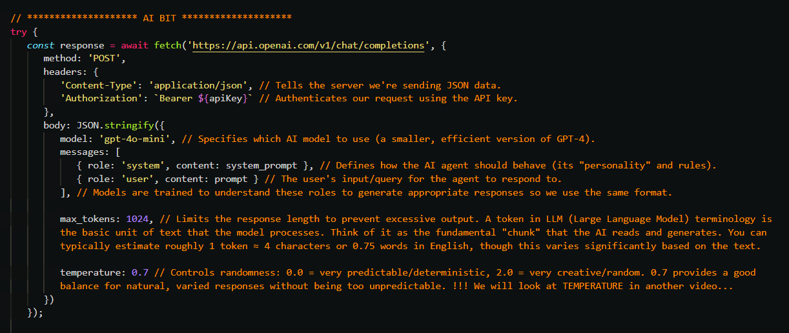

# AI Agents — demystified and simplified

A BrightonDev.ai Meetup talk by Craig West

# GitHub Repo

All code, slides and more...

[https://github.com/Python-Test-Engineer/BrightonDevAI-meetup-nov-2026](https://github.com/Python-Test-Engineer/BrightonDevAI-meetup-nov-2026)


---

<br><br><br>
 
## The one-line pitch

**AI Agents are just code making a REST API call** — admittedly, a very magical
API. Pull away the hype and an agent is a `fetch` (a POST request with a JSON
payload) wrapped in a loop, with some history and some tools bolted on.
That's it. This whole talk is about removing that fear.



*This snippet — a `fetch` to the API with a payload — is the single most
important image of the night. Read it as one POST request: you send the
model's rules and the user's question as a JSON body, and it answers. Every
"agent" you've ever heard of is just this line, wrapped in a harness.*

My goal tonight is not to teach you a framework. It's to **demystify and
simplify** — to show you the patterns and the structure, not the library
details — so that when you go home you can build your own agent, or plug
agents into the workflows you already have. Business as usual.

> A quick word on who's doing the talking. I'm Craig West — one of you, a
> developer — and when I'm not wrestling with agents you'll find me walking a
> Fox Red Labrador (Leo) and a Cockapoo (Pip).
>
> 
>
> We even have a local red fox that follows us on the walks. The dogs and the
> fox have more patience with me than my code does, most days.
>
> 

---

## My take on the AI agent moment

I have been a developer through some shifts, but this one got hold of me
because it felt like a different *world*, not a different tool. So I went
looking for a way in.

Three things were on my mind as I put this talk together:

1. **Client-side control.** Instead of a server team pre-building every
   endpoint, *I* create the endpoint on the client side, at runtime, as I go.
2. **Natural language as the interface.** I write the request in English, my
   language, not a rigid schema.
3. **Autonomy.** The LLM decides the flow. The model chooses what to do next,
   not me.

If those three sound obvious once said — good, they are. That's the whole
point.

### The upside-down mouse

Here's the image I keep coming back to. Picture an upside-down computer mouse.
When you pick one up the wrong way round, it's disorienting — but it's the
*same* set of movements. Left, right, up, down. Just reversed. It takes a
while to retrain your hand, but you already know how to do the motions.


Agentic AI is the upside-down mouse. The concepts are familiar — request,
response, context, functions, loops. We've just got to flip how we think about
who's in charge.

---

## History / Context / Looping / Tools — the building blocks

I keep four words pinned to the front of my mind, because every agent,
however fancy, is built from them:

- **History** — the model is stateless at its core, so we give it memory by
  feeding back previous exchanges.
- **Context** — give it the facts it needs, either statically or fetched
  dynamically.
- **Looping** — repeat the call until the model decides it has a final
  answer.
- **Tools** — runtime functions it can reach for when it needs to do
  something or get more information.

Everything below is just one of these four ideas wearing a different coat.

### Function composition is not new

For me the cleanest mental model is the boss-eyed `function` frame:

```
input -> function(input) -> output -> function(output) -> output2
```

And that "function" can be an agent, just as easily as it can be a class or a
regular method in your app. Agent calls one agent, hands it output, waits for
the next. No different to passing objects between Classes in a codebase. The
first pass writes code with a system prompt; the next pass is a *reviewer*
function that takes that output and produces the next version. Processes and
classes, but with an LLM in the middle of the pipe.

### Why temp = 0 is not deterministic

One small thing I want to flag early (there's a longer note in the repo,
`why_temp_equal_zero_not_deterministic.md`): dropping `temperature` to zero
does **not** make the model deterministic. Don't build tests on that
assumption — the sampling and hardware still introduce variety. Worth keeping
in your back pocket.

---

## Progression through the demos

I've written four tiny HTML pages — each one is just a `<script>` with a
`fetch`. No build step, no framework, no SDK. They step up from "nothing" to
"an agent," and each one adds one more of the four building blocks.

### Demo 1 — the basic call (stateless)

The very first page sends ONE prompt to OpenRouter and prints the answer.
Under the hood it's a `system` message (rules and personality) plus a `user`
message, POSTed over HTTPS.

This is the whole magic trick, unwrapped. No state. Every click is a brand
new conversation as far as the model is concerned. If I button-mash this
page, the AI cannot remember what I said a second ago — because the API
doesn't store anything.

> This snippet — a `fetch` with a payload — is the most important takeaway of
> the whole night. Everything else tonight hangs a harness around this line.

### Demo 2 — RAG (adding context)

Still one call. But now I glue extra facts into the system prompt — facts the
model was never trained on ("the meetup is 29 October at Platform9, speaker
Craig West…"). This is Retrieval-Augmented Generation in its simplest form:
**bake the facts in before you ask.**

It can be dynamic, too. That block of context normally comes from a database,
an API, or a vector search. But the recipe never changes — retrieve the facts,
stuff them in the prompt, ask. Context engineering, done.

### Demo 3 — tool calling (adding tools + a loop)

Now it gets interesting. This page describes two tools to the model, `get_weather`
and `get_sum`, using JSON — **name, description, parameter schema**. Crucially,
the model never runs them. It only *asks*: "call this tool, with these
arguments." My code does the actual execution via a `switch` (no magic), then
hands the result back into the conversation.

And here's the shift: **this is the agent loop.** The loop keeps running
while the model asks for tools and stops when it decides it has a final
answer (with a max-iteration guard so we never loop forever). The model
directs the flow. That's the autonomy point from earlier, code in front of
you.

### Demo 4 — memory (adding history)

Last building block. Same single `fetch`, but now we keep the whole
conversation in `messages` and **resend all of it every call**. That's all
"memory" is — you replay the tape back into the model each time. And because
it's a browser, we persist it to `localStorage`, so a refresh keeps the chat.

The honest cost is right in the console: more history = more tokens = more
money. Memory engineering is really token budget management.

---

## PROMPT ENGINEERING → CONTEXT ENGINEERING → HARNESS ENGINEERING

I want to end on the point that changed how I think.

Tools to build your own coding agent are not as scary as they sound. You need:
list files, read a file, edit a file, write a file — and honestly, `bash`
alone is enough; it subsumes the rest.

The bigger idea though, the one I keep telling people:

> **A harness with a lower model can outperform a higher model.** Often it's
> the harness — the loop, the context, the tools, the memory — that decides
> the outcome, not the raw intelligence of the LLM.

That's liberating. It means the craft and the content of our jobs still
matter. The engineering around the model is what makes it sing. My minimal
coding agent is just a loop that runs until it finds an answer — and then I
look back at the demo and think: everything we saw tonight was already there
in miniature.

---

## Leave-behinds

Everything tonight is in the repo — the HTML pages, the notes, links to the
explainer videos, and my mini coding-agent for you to fork and build on.

Repo: https://github.com/Python-Test-Engineer/BrightonDevAI-meetup-nov-2026

Look at the patterns and the structure, not the code details. That is what
got me through the upside-down-mouse moment — and it's what turns "AI agents"
from a different world back into just code.
